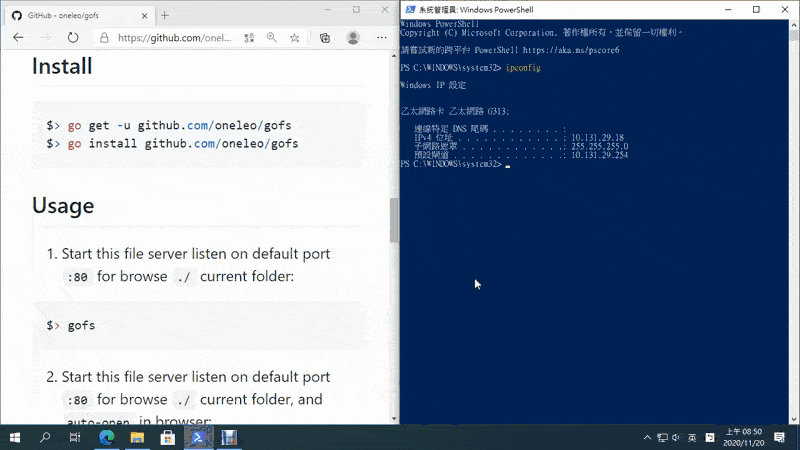

# FSGO
 FSGO is a small file server with ZIP compression function for Browsing specify local folder and files.

## PreRequire
- Install [Git](https://git-scm.com/) - Distributed version control system.
- Install [Golang](https://golang.org/) - Programming language.
  - For Windows OS: Make sure `%GOPATH%\bin` is inclouded in `%PATH%` environmental variables.
  - For Linux OS: Make sure `$GOPATH/bin` is inclouded in `$PATH` environmental variables.

## Install
```golang
$> go get -u github.com/oneleo/fsgo
$> go install github.com/oneleo/fsgo
```

## Usage
1. Start this file server listen on default port `:80` for browse `./` current folder:
```bash
$> fsgo
```



2. Start this file server listen on default port `:80` for browse `./` current folder, and `auto-open` in browser:
```bash
$> fsgo -b
```

3. Start this file server listen on specified port `:8081` for browse specified `./www` folder, and `auto-open` in browser:
```bash
$> fsgo -p 8081 -f ./www -b
```

4. Help message
```bash
$> fsgo -h
OR
$> fsgo --help
```

```text
$> fsgo -h
FSGO is a small file server with ZIP compression function for Browsing specify local folder and files.
Usage:

        fsgo [-p port] [-f folder] [-b]

Flags:
  -b    Open URL in browser (shorthand)
  -f string
        Set shared folder (shorthand) (default "./")
  -p int
        Set listening port (shorthand) (default 80)

Examples:
  fsgo
        Start this file server listen on port ":80" for browse "./" current folder.
  fsgo -b
        Start this file server listen on port ":80" for browse "./" current folder, and open in browser.
  fsgo -p 8081 -f ./www -b
        Start this file server listen on specify port ":8081" for browse "./www" specify folder, and open in browser.
```

## References
- [GitHub - Simple static file server](https://github.com/golang-id/gost)
- [GitHub Gist - Open browser in golang](https://gist.github.com/hyg/9c4afcd91fe24316cbf0)
- [Stackoverflow - Start web server to open page in browser](https://stackoverflow.com/questions/39320371/how-start-web-server-to-open-page-in-browser-in-golang)